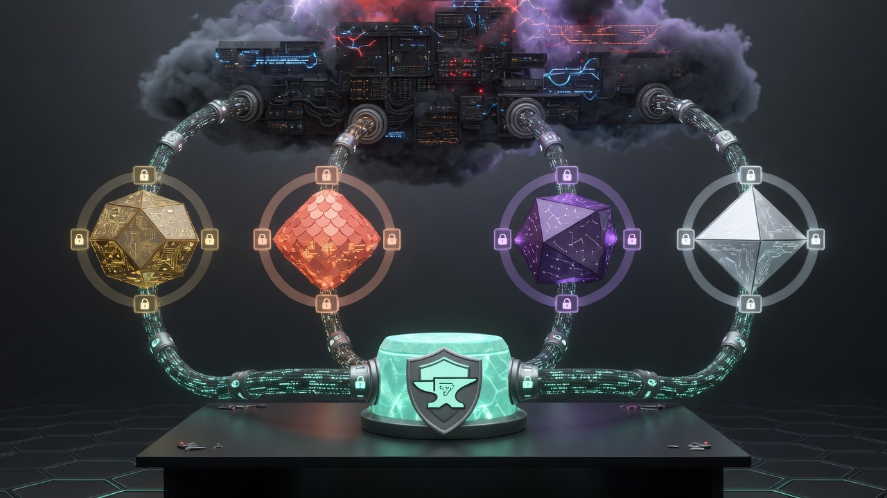
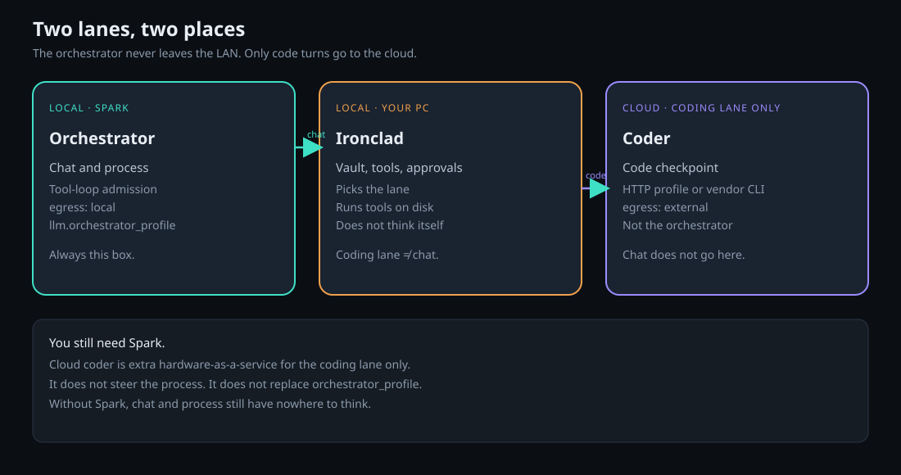
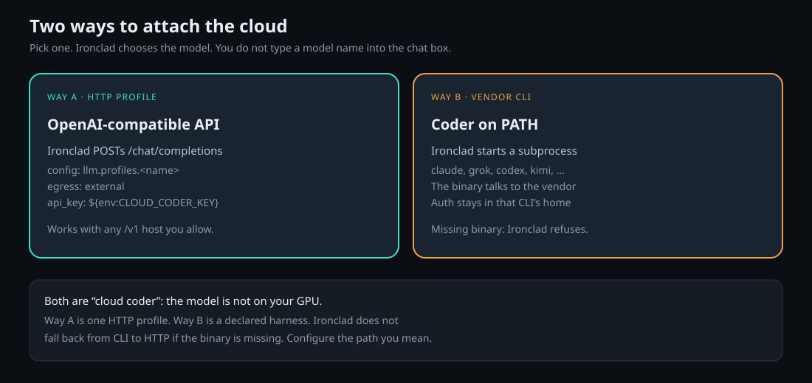
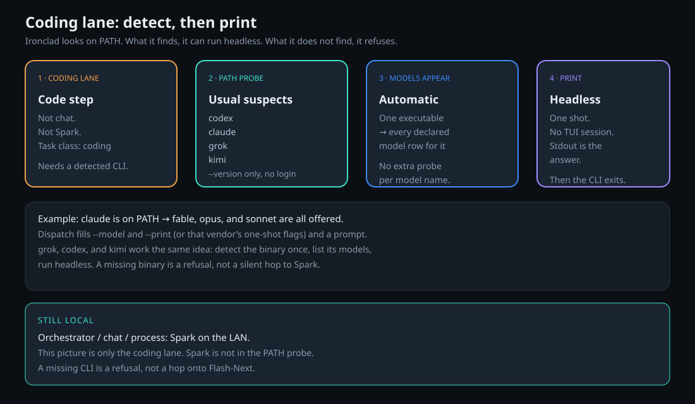
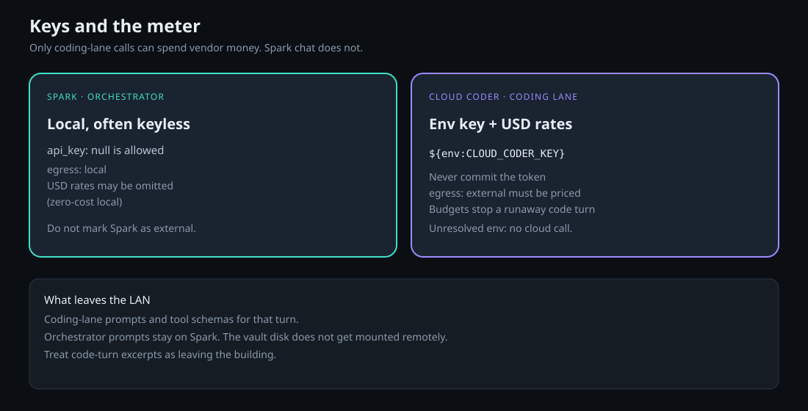

# Ironclad with a cloud coder

The **orchestrator** always talks to a **local Spark**. A **cloud coder** is only the **coding lane**: the step that writes or patches code. Chat, process steering, and tool-loop admission stay on Spark.

Public sources will live in the `ironclad` repo. This tree explains the idea. It is not those sources.



## The one picture



| Lane | Where the model lives |
|---|---|
| **Orchestrator** (chat, process, tool loop) | Local Spark, `egress: local` |
| **Coding lane** (the Code checkpoint) | Cloud coder, `egress: external` |

Ironclad never mounts your disk in the cloud. It sends a prompt (and tool schemas) for that coding turn, gets text or a tool call back, then runs tools itself next to Spark.

Without Spark, chat and process runs still have no orchestrator. Cloud coder does **not** replace Spark.

## Two ways to attach the coding lane



**Way A — HTTP profile.** Ironclad POSTs to `<base_url>/chat/completions` for the **coding** profile only. `egress: external`, key as `${env:CLOUD_CODER_KEY}`.

**Way B — vendor CLI.** Ironclad starts a binary on `PATH` (`codex`, `claude`, `grok`, `kimi`, …) for the coding task class. That CLI talks to the vendor. Missing binary: Ironclad **refuses**. It does not fall back to Spark or to HTTP.

The coding route names that profile. `llm.orchestrator_profile` stays the Spark key. Callers do not pick the model in the chat box.

## Detect, list models, run `--print`



Ironclad does not ask you to type `claude --model …` for each job. On the **coding lane** it:

1. Probes **local `PATH`** on the Ironclad box (this workstation, not Spark) for the usual suspects (`codex`, `claude`, `grok`, `kimi`) with a cheap `--version`. That probe does not log in.
2. If the **executable** is there, **every declared model row** for that harness is offered. One `claude` binary yields `fable`, `opus`, and `sonnet` — there is no second probe per model name.
3. Dispatch is **headless print**: one shot, no TUI. Claude: `--print`. Codex: `exec`. Grok: `--output-format plain --single`. Kimi: `--prompt`. Stdout is the answer, then the CLI exits.

The binaries live **here, locally**. Spark only serves the orchestrator. Probed on this logged-in workstation (2026-09-07): Codex 0.153.2, Claude Code 2.1.263, Grok 1.0.13, Kimi 0.34.0.

| On PATH | How we listed models | Coding-lane set |
|---|---|---|
| `codex` | live `models_cache.json` (9 slugs). Default in `config.toml`: `gpt-5.6-sol` | `gpt-6-astra`, `gpt-5.6-sol`, `gpt-5.6-terra`, `gpt-5.6-luna` |
| `claude` | `--help` aliases | `fable`, `opus`, `sonnet` |
| `grok` | `grok models` | `grok-4.6` (default), `grok-4.5` |
| `kimi` | `kimi provider list --json` | `k3` (default), `k3-256k`, `kimi-for-coding`, `kimi-for-coding-highspeed` |

Codex also advertised `gpt-5.5`, `gpt-5.4-mini`, `gpt-5.3-codex-spark`, `gpt-reserve`, and `codex-auto-review`. Those are not the coding-lane pin. Claude’s help example for a full name is `claude-fable-5`; the aliases above are what `--model` documents.

A missing binary is `INFRA`, not “use Spark instead.” Spark never sits in that PATH list.

## Config sketch (no secrets)

Spark remains the orchestrator. The cloud profile is a second key, used only by the coding lane.

```yaml
llm:
  base_url_allowed_hosts:
    - 127.0.0.1
    - api.example.com
  orchestrator_profile: spark
  profiles:
    spark:
      base_url: http://127.0.0.1:8000/v1
      api_key: null
      model: Qwen3.8-Flash-Next
      egress: local
      model_identity:
        kind: hosted
        provider: sglang
        model_id: Qwen3.8-Flash-Next
      max_output_tokens: 4096
      default_thinking_policy: disabled
    cloud_coder:
      base_url: https://api.example.com/v1
      api_key: ${env:CLOUD_CODER_KEY}
      model: example-coder
      egress: external
      model_identity:
        kind: hosted
        provider: example-provider
        model_id: example-coder
      input_usd_per_1m_tokens: 1.25
      output_usd_per_1m_tokens: 5.0
      max_output_tokens: 4096
      default_thinking_policy: disabled
```

- `orchestrator_profile: spark` is not the cloud key.
- External **coding** profiles must declare both USD rates so budgets can stop a runaway code turn.
- Spark may omit prices (local, zero-cost). Do not copy that onto `cloud_coder`.
- Put every `base_url` host in `base_url_allowed_hosts`.



Set `CLOUD_CODER_KEY` in the process that starts Ironclad. Never commit it. Unresolved `${env:…}`: no cloud request is sent. Spark stays keyless if the local server is keyless.

## What this costs

Spark electricity stays. Cloud tokens apply **only when the coding lane runs**. Chat on Spark does not hit the vendor meter.

Treat coding prompts as leaving the building: excerpts Ironclad puts in that request go to the vendor. The orchestrator prompt stays on the LAN.

## When to use which lab

| Path | Role |
|---|---|
| [Flash-Next on Spark](https://github.com/GrokBuildMJW/Qwen3.8-Flash-Next-NVFP4-SGLang-DGX-Spark) | **Required** local orchestrator |
| This repo | Coding lane in the cloud |
| [Qwen3-Coder on RTX 4090](https://github.com/GrokBuildMJW/Qwen3-Coder-30B-A3B-Q4_K_M-llama.cpp-RTX-4090) | Coding lane on a local GPU instead |
| [Minimal hardware](https://github.com/GrokBuildMJW/Ironclad-AI-minimal-hardware) | Engine in Docker on one PC (still needs Spark or another orchestrator API) |
| [Self-hosted CI](https://github.com/GrokBuildMJW/Ironclad-AI-self-hosted-GitHub-CI) | GitHub Actions, not an LLM path |

## What this is not

- Not a Spark replacement. Orchestrator stays local.
- Not “put chat in the cloud.” Only the coding lane.
- Not a promise that coding prompts stay on your LAN.
- Not a vendor comparison and not an API-key store.

## License

MIT for the notes and diagrams in this tree.
